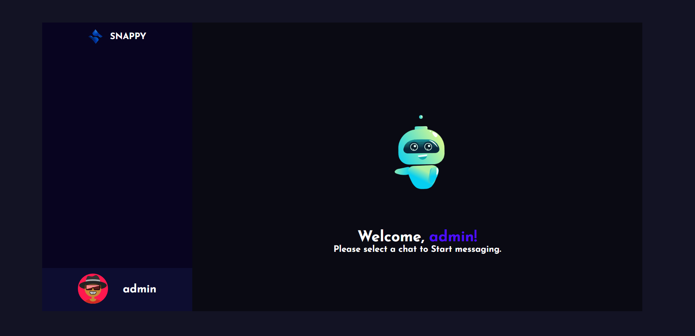

# Snappy - Chat Application 
Snappy is chat application build with the power of MERN Stack. 

## Installation Guide

### Requirements
  -NodeJS
  -MongoDB

Both should be installed and make sure mongodb is running.

Now rename env files from .env.example to .env

  cd public
  mv .env.example .env
  cd ..
  cd server
  mv .env.example .env
  cd ..

Now install the dependencies
  cd server
  yarn
  cd ..
  cd public
  yarn

We are almost done, Now just start the development server.

For Frontend.
shell
  cd public
  yarn start

For Backend.

Open another terminal in folder, Also make sure mongodb is running in background.
  cd server
  yarn start

Done! Now open localhost:3000 in your browser.
